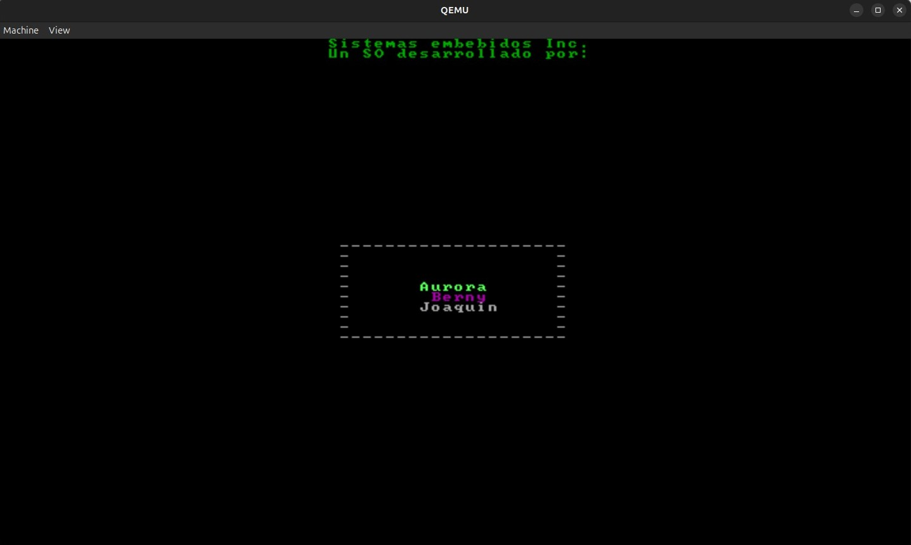

# Kernel x86: Programación de Sistemas y Resolución

Este proyecto es un kernel educativo para arquitecturas x86, desarrollado en el contexto de talleres prácticos de programación de sistemas. El objetivo es comprender y poner en práctica los conceptos fundamentales de la arquitectura de computadoras, el funcionamiento de un sistema operativo a bajo nivel y la interacción directa con el hardware.

## Descripción General

El kernel implementa desde cero mecanismos esenciales de un sistema operativo moderno: segmentación, modo protegido, manejo de interrupciones, paginación, administración de tareas y scheduling. El desarrollo se realiza en lenguaje C y ensamblador, ejecutándose sobre un entorno emulado (QEMU) y depurado con GDB.

## Componentes y Resolución

### 1. Modo Protegido y Segmentación
- **Segmentación:** Se define la GDT (Global Descriptor Table) con segmentos para código y datos, tanto para nivel de kernel (0) como de usuario (3), siguiendo el modelo "flat" para simplificar la segmentación.
- **Modo protegido:** El kernel arranca en modo real y realiza la transición a modo protegido, habilitando el bit correspondiente en CR0 y realizando un salto far para comenzar la ejecución protegida.
- **Inicialización:** Se cargan los selectores de segmento, se configura la pila y se imprime un mensaje de bienvenida en modo protegido.

### 2. Manejo de Interrupciones
- **IDT:** Se define la tabla de descriptores de interrupción (IDT), con entradas para excepciones, interrupciones de hardware (reloj, teclado) y syscalls.
- **Rutinas de atención:** Se implementan handlers en ensamblador para cada interrupción, preservando el estado del procesador y utilizando `iret` para retornar.
- **PIC:** Se inicializa y remapea el PIC para evitar conflictos con las excepciones del procesador.
- **Syscalls:** Se agregan interrupciones de software accesibles desde nivel de usuario para interacción con el kernel.

### 3. Paginación y MMU
- **Paginación:** Se implementa la unidad de manejo de memoria (MMU), inicializando directorios y tablas de páginas para el kernel y las tareas.
- **Mapeo de memoria:** Se realiza identity mapping para el kernel y mapeos específicos para las tareas, incluyendo memoria compartida on-demand.
- **TLB:** Se gestiona el TLB y se fuerza su purgado (`tlbflush`) al modificar las estructuras de paginación.
- **Page Fault:** Se maneja la excepción de page fault para mapear la memoria compartida cuando es accedida por primera vez.

### 4. Administración de Tareas y Scheduling
- **TSS:** Se definen y cargan los descriptores de TSS (Task State Segment) en la GDT para cada tarea, incluyendo la tarea inicial e idle.
- **Scheduler:** Se implementa un scheduler round-robin que decide la próxima tarea a ejecutar en cada tick del reloj.
- **Cambio de contexto:** El cambio de tarea se realiza mediante saltos far y actualización del Task Register (TR), preservando y restaurando el estado de cada tarea.
- **Tareas de usuario:** Se proveen ejemplos de tareas (Pong, Snake, Game of Life, Scoreboard) que interactúan con el kernel mediante syscalls y memoria compartida.

### 5. Interacción con el Hardware
- **Teclado y reloj:** Se atienden interrupciones de hardware para el teclado y el reloj, permitiendo interacción y animaciones en pantalla.
- **Pantalla:** Se accede al buffer de video directamente para dibujar texto y gráficos, utilizando rutinas propias.

## Estructura del Código
- **src/**: Contiene el código fuente del kernel, incluyendo C y ensamblador.
- **TPSP/**: Documentación y consignas de los talleres.
- **tareas/**: Código fuente de las tareas de usuario.
- **img/**: Imágenes de apoyo y diagramas.

## Equipo de Desarrollo

- **Diessler Bernardo**
- **Ferreyra Santiago Joaquin**
- **Velasco Aurora**  

## Proceso de Ejecución
1. Compilación con `make` genera la imagen del kernel.
2. Ejecución en QEMU permite probar el sistema y depurarlo con GDB.
3. Se pueden inspeccionar las estructuras internas (GDT, IDT, TSS, tablas de páginas) y el estado del procesador en tiempo real.

## Conceptos Aprendidos
- Arquitectura x86: modos de operación, segmentación, paginación, manejo de interrupciones.
- Programación de bajo nivel: interacción directa con hardware, uso de ensamblador y C.
- Diseño de sistemas operativos: administración de memoria, multitarea, scheduling, protección y privilegios.

---
## Capturas de pantalla

---
Este proyecto es una base sólida para comprender el funcionamiento interno de un sistema operativo y la arquitectura x86, permitiendo experimentar y modificar cada componente fundamental del kernel.
