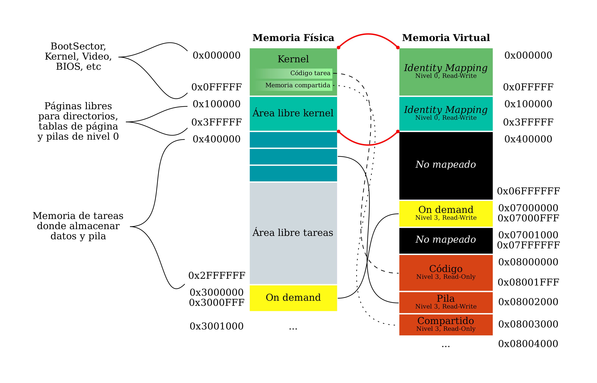

# System Programming: Paginación.

En este taller vamos a inicializar y a habilitar los mecanismos de
manejo de memoria de nuestro kernel. En particular, activaremos el
módulo de paginación del microprocesador

## Organización de la memoria 

Primero vamos a explicar cómo se encuentra el mapa de memoria física
para comprender de qué modo inicializar las tablas de memoria. El primer
MB de memoria física será organizado según indica la figura
[1].
En la misma se observa que a partir de la dirección `0x1200` se
encuentra ubicado el *kernel*; inmediatamente después se ubica el código
de las tareas A y B. A continuación se encuentra el código de la tarea
Idle. El resto del mapa muestra el rango para la pila del kernel, desde
`0x24000` y a continuación la tabla y directorio de páginas donde
inicializar paginación para el kernel. La parte derecha de la figura
muestra la memoria a partir de la dirección `0xA0000`, donde se
encuentra mapeada la memoria de vídeo y el código del `BIOS`.


## Unidad de Manejo de Memoria

Ya viendo la memoria física en forma más general, vemos que se divide
en: *kernel*, *área libre kernel* y *área libre tareas*.

El área asociada al *kernel* corresponde al primer MB de memoria, el
*área libre kernel* a los siguientes 3 MB, y el *área libre tareas*
comienza en el cuarto MB de memoria.

La administración de las áreas libres de memoria (área libre de kernel y
área libre de tareas) se realizará a partir de una región de memoria
específica para cada una. Podemos comprenderlas como un arreglo
predefinido de páginas y dos contadores de páginas, uno para kernel y
otro para usuarix, que indican cuál será la próxima página a emplear de
cada región. Para páginas de kernel el arreglo va de `0x100000` a
`0x3FFFFF` y para páginas de usuarix de `0x400000` a `0x2FFFFFF`. Luego
de cada pedido incrementamos el contador correspondiente. Para el
contexto de la materia no implementamos un mecanismo que permita liberar
las páginas pedidas. Vamos a referirnos al módulo que implementa este
mecanismo como la **unidad de manejo de memoria**, o en inglés, *memory
management unit*, MMU.

Las páginas del *área libre kernel* serán utilizadas para datos del
kernel: directorios de páginas, tablas de páginas y pilas de nivel cero.
Las páginas del *área libre tareas* serán utilizadas para datos de las
tareas, stack de las mismas y memoria compartida bajo demanda.



La memoria virtual de cada una de las tareas tiene mapeado inicialmente
el *kernel* y el *área libre kernel* con *identity mapping* en nivel 0.
Además se mapearán las páginas de código correspondientes, la página de
memoria compartida y una página para la pila obtenida desde el *área
libre de tareas*.

A partir de la dirección virtual *0x07000000* se encontrará una página
de memoria compartida de lectura y escritura nivel 3. Esta página será
mappeada on-demand cuando se intente hacer una lectura o escritura en
este espacio. La página física debe encontrarse en la dirección
*0x03000000*.

El código de las tareas se encontrará a partir de la dirección virtual
*0x08000000* y será mapeado como sólo lectura de nivel 3 a la dirección
física del código correspondiente. Cada tarea puede utilizar hasta 8Kb
de código. El stack será mapeado en la página siguiente, con permisos de
lectura y escritura. La página física debe obtenerse del *área libre de
tareas*. Finalmente, luego de la pila se mapeará la página de memoria
compartida como sólo lectura de nivel 3. Esta página la usaremos más
adelante para que las tareas puedan acceder fácilmente a información
relevante del contexto de ejecución (teclas apretadas, tiempo desde el
arranque del sistema, etc).

### Notas 

- Por construcción del *kernel*, las direcciones de los mapas de memoria (`page directory` y `page table`) están mapeadas con *identity mapping*.

- En las funciones en donde se modifica el directorio o tabla de páginas, se debe llamar a la función `tlbflush` para que se invalide la *cache* de traducción de direcciones.

### Uso de qemu+gdb 

A continuación una descripción de los comandos que pueden utilizar en
gdb para acceder a la información sobre el mapeo de páginas:

-   `info page` - muestra información general sobre el mapeo

-   `info page [vaddr]` - muestra la traducción de *vaddr* dando el detalle de las entradas PD y PT correspondientes

-   `info page directory` - lista las entradas presentes del PD actual con sus atributos

-   `info table [idx]` - lista las entradas presentes de la i-ésima page table

-   `x /nuf [addr]` - Muestra el contenido de la dirección `[addr]`

-   `xp /nuf [addr]` - Muestra el contenido de la dirección física `[addr]`\
    `n` es el número que indica cuantos valores se mostrarán (default 1)\
    `u` es el tamaño de la unidad, puede ser[^1]:

      ------------------------ ----------------------------
      `b : byte`               `h : word (half-word)`
      `w : doubleword(word)`   `g : quadword(giant word)`
      ------------------------ ----------------------------

    `f` es el formato del número, puede ser:

      ------------- ------------------- -----------------
      `x : hex`     `d : decimal`       `u : sin signo`
      `o : octal`   `t : binario`       `c : char`
      `s : ascii`   `i : instrucción`   
      ------------- ------------------- -----------------

[^1]: Entre paréntesis el nombre consistente con gdb

## Ejercicios

### Primera parte: Preguntas teoricas 

a)  ¿Cuántos niveles de privilegio podemos definir en las estructuras de
    paginación?
```

Se pueden definir dos niveles de privilegio: Usuario, el nivel menos
privilegiado, y Supervisor, el que más.
```

b)  ¿Cómo se traduce una dirección lógica en una dirección física? ¿Cómo
    participan la dirección lógica, el registro de control `CR3`, el
    directorio y la tabla de páginas? Recomendación: describan el
    proceso en pseudocódigo
```

La dirección lógica se va a dividir en tres partes, cada una va a ser el
offset de una dirección física. Los bits 11-0 son el offset de la dirección
real, 21-11 de la tabla de páginas y 31-22 del directorio de tablas de páginas.
El CR3 contiene la dirección del directorio de páginas en los 20 bits más
significativos, (los 12 bits que faltan serían el offset dentro de la
página) que vamos a extender con ceros en sus 12 bits menos significativos
para tener la base del directorio de páginas.
Desde la base del directorio de páginas se va a ir al índice dado por los
bits 31-22 de la dir. lógica, llegando a la entrada del directorio que
buscamos. Esta a su vez tiene la dirección base de la tabla de páginas que
buscamos en sus 20 bits más significativos, usamos esta dirección. A su
vez, sus 12 bits inferiores contienen los descriptores de la taba, con
nivel de privilegio, permisos de escritura/lectura, etc.
Con la base de la tabla de páginas, usamos los bits 21-11 de la dir. lógica
para movernos al elemento de ese índice, que va a tener la información de
la dirección de página real.
Volvemos a usar los 20 bits más altos de la entrada de la taba y nos
dirigimos con esto a la base de la página en la dirección de memoria real.
Con los bits 11-0 de la dir. lógica tenemos el offset dentro de la página.
```


c)  ¿Cuál es el efecto de los siguientes atributos en las entradas de la
    tabla de página?
```

- `D` - (Dirty) Indica si se escribio a memoria controlada por esta PTE, lo escribe el procesador al traducir
- `A` - (Accesed) Indica si se accedio a memoria controlada por esta PTE, lo escribe el procesador al traducir
- `PCD` - (Page Cache Disable) Deshabilita guardar en cache de esta pagina
- `PWT` -  (Page Write-Through) Deshabilita hacer write-back en esta pagina
- `U/S` - (User/Supervisor) Permisos de pagina
- `R/W` - (Read/Write) Determina si se puede escribir en esta pagina
- `P` - (Present) Indica que esta pagina es valida
```

d)  ¿Qué sucede si los atributos U/S y R/W del directorio y de la tabla
    de páginas difieren? ¿Cuáles terminan siendo los atributos de una
    página determinada en ese caso? Hint: buscar la tabla *Combined
    Page-Directory and Page-Table Protection* del manual 3 de Intel
```

Una página va a requerir permisos de supervisor si la entrada del
directorio o la de la tabla tiene permisos de supervisor, en el caso
contrario ambas son de usuario y la página entonces también.
Y va a ser de lectura/escritura si en ambos casos es de lectura/escritura,
caso contrario solo lectura.
```

e)  Suponiendo que el código de la tarea ocupa dos páginas y
    utilizaremos una página para la pila de la tarea. ¿Cuántas páginas
    hace falta pedir a la unidad de manejo de memoria para el
    directorio, tablas de páginas y la memoria de una tarea?
```

Hace falta pedir cinco páginas, una página para el directorio de páginas,
una para la tabla de páginas, dos para las páginas de código y una para la
página de pila. Más adelante en el TP usamos memoria compartida, que
agregaría una página más.
```

f)  Completen las entradas referentes a MMU de `defines.h` y comprendan
    la función y motivación de dichos defines:

  - `VIRT_PAGE_DIR(X)`: Dada `X` una dirección virtual calcula el índice dentro del directorio de páginas de la PDE asociada.

  - `VIRT_PAGE_TABLE(X)`: Dada `X` una dirección virtual calcula el índice dentro de la tabla de páginas de la PTE asociada.

  - `VIRT_PAGE_OFFSET(X)`: Dada `X` una dirección devuelve el offset dentro de su página.

  - `CR3_TO_PAGE_DIR(X)`: Obtiene la dirección física del directorio donde `X` es el contenido del registro `CR3`.

  - `MMU_ENTRY_PADDR(X)`: Obtiene la dirección física correspondiente, donde `X` es el campo address de 20 bits en una entrada de la tabla de páginas o del page directory

g)  ¿Qué es el buffer auxiliar de traducción (*translation lookaside
    buffer* o **TLB**) y por qué es necesario purgarlo (`tlbflush`) al
    introducir modificaciones a nuestras estructuras de paginación
    (directorio, tabla de páginas)? ¿Qué atributos posee cada traducción
    en la TLB? Al desalojar una entrada determinada de la TLB ¿Se ve
    afectada la homóloga en la tabla original para algún caso?
```

El TLB funciona como una cache de traducciones para las páginas. Permite
acceder más rapido a la dirección física en base a la dirección lógica.
Hace falta purgarlo al modificar el directorio o una tabla de páginas
porque puede cambiar la relación de dirección lógica y la física.
Cada traducción guarda:
- La dirección física de la página
- Los derechos de acceso (bits R/W, U/S del descriptor de página)
- Si la pág. está usada y el tipo de memoria

Si se desaloja una entrada en la cache, la original va a permanecer igual.
```

### Segunda parte: Activando el mecanismo de paginación.

a)  Escriban el código de las funciones `mmu_next_free_kernel_page`,
    `mmu_next_free_user_page` y de `mmu_init_kernel_dir` de `mmu.c` para
    completar la inicialización del directorio y tablas de páginas para
    el *kernel*.

  > Recuerden que las entradas del directorio y la tabla deben realizar un mapeo por identidad (las direcciones lineales son iguales a las direcciones físicas) para el rango reservado para el kernel, de `0x00000000` a `0x003FFFFF`, como ilustra la figura [2]. Esta función debe inicializar también el directorio de páginas en la dirección `0x25000` y las tablas de páginas según muestra la figura [1] ¿Cuántas entradas del directorio de página hacen falta?

Vamos a necesitar sólo una entrada del directorio de páginas, que va a apuntar a una tabla con 1024 elementos llenos de páginas de 4kb, que nos dan los 4mb que necesitamos.

b)  Completar el código para activar paginación en `kernel.asm`.
    Recuerden que es necesario inicializar el registro `CR3` y activar
    el bit correspondiente de CR0. Esta inicialización debe realizarse
    antes de activar las interrupciones del procesador.

c)  Introduzcan un breakpoint luego de activar paginación y prueben
    hacer **info page** para comprobar que el mapeo identidad se realizó
    correctamente.

### Tercera parte: Definiendo la MMU.

a)  Completen el código de la función `mmu_map_page`, `mmu_unmap_page`

b)  Completen el código de `copy_page`, ¿por qué es necesario mapear y
    desmapear las páginas de destino y fuente? ¿Qué función cumplen
    `SRC_VIRT_PAGE` y `DST_VIRT_PAGE`? ¿Por qué es necesario obtener el
    CR3 con rcr3()?
```

Es necesario mapear y desmapear las direcciones físicas dadas porque una vez activado
paginación todas las direcciones que se usan son consideradas virtuales. Si las usaramos
directamente no nos llevarían a donde queremos. `SRC_VIRT_PAGE` y `DST_VIRT_PAGE` son dos
direcciones virtuales que no están mapeadas y usamos para copiar datos sin riesgo de usar
una dirección que ya esté usada. Es necesario usar rcr3() porque en C no podemos acceder al
registro CR3 directamente. 
```

c)  Realicen una prueba donde se compruebe el funcionamiento de
    `copy_page`. Pueden usar gdb con el comando `x` para inspeccionar el
    contenido de direcciones virtuales y `xp` para inspeccionar el
    contenido de direcciones físicas.

d)  Completen la rutina (`mmu_init_task_dir`) encargada de inicializar
    un directorio de páginas y tablas de páginas para una tarea,
    respetando la figura [2]. La rutina debe mapear las páginas de
    código como solo lectura, a partir de la dirección virtual
    `0x08000000`, el stack como lectura-escritura con base en
    `0x08003000` y la página de memoria compartida luego del stack.
    Recuerden que la memoria para la pila de la tarea debe obtenerse del
    area libre de tareas.

e)  Completen la rutina de atención de interrupción del Page Fault para
    que, si se intenta acceder al rango de memoria compartido on demand
    cuando este no está mapeado, se mapee. Respeten la figura
    [2]. Se debe mapear como de lectura-escritura a nivel usuario.

f)  A modo de prueba, en `kernel.asm` vamos a construir un mapa de
    memoria para una tarea ficticia (es decir, cargar el `CR3` de una
    tarea) e intercambiarlo con el del *kernel*. Para esto tendrán que
    usar la función antes construida, `mmu_init_task_dir`. Supongan que
    la tarea se encuentra ubicada en la dirección física 0x18000.

  - Una vez hecho el cambio de cr3, hagan dos escrituras en alguna
    parte de la zona de memoria compartida on-demand y luego vuelvan
    a la normalidad. Deberían ver el mensaje
    `”Atendiendo Page Fault...”` luego de la primer escritura y
    ningún mensaje luego de la segunda.

  - Inspeccionen el mapa de memoria con el comando `info page` con
    breakpoints una vez que se asigna el `CR3` de la tarea y cuando
    se restituye el `CR3` del kernel.
